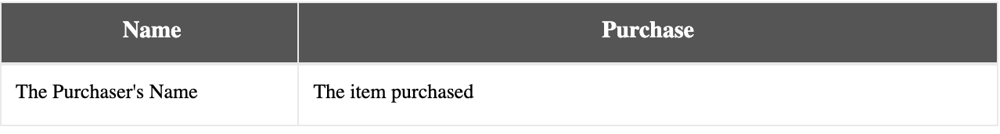

<h3>Example of tree view manipulation</h3>
<div>Open <a href="https://stackblitz.com/edit/tablejs-infinite-scroll-stjdts" target="_blank">Example</a> in StackBlitz <a href="https://stackblitz.com/edit/tablejs-infinite-scroll-stjdts" target="_blank"><i class="fas fa-external-link-alt"></i></a></div><p></p>
<iframe width="100%" height="650px" src="https://stackblitz.com/edit/tablejs-infinite-scroll-stjdts?ctl=1&embed=1&file=src/app/app.component.ts&hideExplorer=1&hideNavigation=1&theme=light&view=preview"></iframe>

<div style="display:none;">


### Getting Started

#### Installation

`$ npm install --save @tablejs/community`

#### Implementation

##### Set Up
1. Import the `TablejsModule` into your app.module.ts file.

	```javascript
	import { TablejsModule } from '@tablejs/community';
```
2. Add the `TablejsModule` to the list of imports in your app.module.ts file.

	```javascript
	@NgModule ({
		declarations: [ ... ],
		imports: [ TablejsModule ],
		providers: [ ... ]
	});
```

3. Let's create a component and place some HTML table markup in the component's Typescript file.  Consider the following HTML:

	```html
	<table>
		<thead>
			<tr>
				<th>
					<div>Name</div>
				</th>
				<th>
					<div>Purchase</div>
				</th>
			</tr>
		</thead>

		<tbody>
			<tr>
				<td>
					<div class="name">
						The Purchaser's Name
					</div>
				</td>
				<td>
					<div class="item">
					The item purchased
					</div>
				</td>
			</tr>
		</tbody>
	</table>
```
4. And its corresponding SCSS:

	```CSS
	div {
	  position: relative;
	  padding: 0px;
	  margin: 0;
	  box-sizing: border-box;
	}

	table {
	  font-family: Lato;
	  table-layout: fixed;
	  border-collapse: collapse;
	  border-spacing: 0px;
	  padding: 0;
	  margin: 0;
	  width: 100%;
	  thead {
		display: table-header-group;
	  }
	  tbody {
		display: table-row-group;
	  }
	  thead,
	  tbody {
		position: relative;
		left: 0px;
		top: 0px;
		width: 100%;

		tr {
		  display: grid;
		  grid-template-columns: 30% 70%;

		  th,
		  td {
			position: relative;
			border: 1px solid #e9e9e9;
			height: 36px;
			width: 100%;
			div {
			  position: relative;
			  padding: 8px;
			  width: 100%;
			  height: 100%;
			  overflow: hidden;
			  white-space: nowrap;
			  text-overflow: ellipsis;
			}
		  }
		  th {
			text-align: center;
			background-color: #555555;
			div {
			  color: #ffffff;
			  font-size: 15px;
			}
		  }
		  td {
			background-color: #ffffff;
			div {
			  font-size: 13px;

			  &.name {
				width: 100%;
			  }
			  &.item {
				width: 100%;
			  }
			}
		  }
		}
	  }
	}
	```

	You should now have a table that looks something like this:

	

5. Now that we have a simple table in place, let's display some dynamic data in the table.  Create an array of items in your component's Typescript file for displaying in the table.

	```javascript
	purchases: any[] = [
		{
		  name: 'John Hughes',
		  item: 'Cameras',
		},
		{
		  name: 'Mickey Mouse',
		  item: 'Whistles',
		},
		{
		  name: 'Amelia Earhart',
		  item: 'Goggles',
		},
		{
		  name: 'Godzilla',
		  item: 'Breath Mints',
		},
	];
```

	To display this data in the template, we will use the `ngFor` directive to iterate over each item in the array.  Then replace our static name and purchase item with the corresponding variables from our array.

	```HTML
	<table>
	  <thead>
		<tr>
		  <th>
			<div>Name</div>
		  </th>
		  <th>
			<div>Purchase</div>
		  </th>
		</tr>
	  </thead>

	  <tbody>
		<tr *ngFor="let purchase of purchases">
		  <td>
			<div class="name">{{ purchase.name }}</div>
		  </td>
		  <td>
			<div class="item">{{ purchase.item }}</div>
		  </td>
		</tr>
	  </tbody>
	</table>
	```


#####TableJS Initialization
If we want to enable resize or reordering, we will need to supply TableJS with row, column, and viewport information.  

1. **Register rows:** TableJS will be able to track row information once we place the `tablejsGridRow` directive on each `tr` element.

	```HTML
	<tablejs-grid>
		<table>
			<thead>
			  <tr tablejsGridRow>
				<th>
				  <div>Name</div>
				</th>
				<th>
				  <div>Purchase</div>
				</th>
			  </tr>
			</thead>

			<tbody>
			  <tr *ngFor="let purchase of purchases" tablejsGridRow>
				<td>
				  <div class="name">{{ purchase.name }}</div>
				</td>
				<td>
				  <div class="item">{{ purchase.item }}</div>
				</td>
			  </tr>
			</tbody>
		</table>
	</tablejs-grid>
	```
	
	Great!  TableJS can now register your rows!
	
2. **Declare column data:** Next, we will need to tie the columns from the `thead` tag to the columns in the `tbody` tag for sizing calculations.  TableJS uses CSS classes to accomplish this.  Let's replace the `class` attribute on the `td div` element with the `tablejsDataColClass`directive.  The class name supplied to the `tablejsDataColClass` directive will automatically placed on the `td div`.
	
	```HTML
	<tablejs-grid>
		<table>
			<thead>
			  <tr tablejsGridRow>
				<th>
				  <div>Name</div>
				</th>
				<th>
				  <div>Purchase</div>
				</th>
			  </tr>
			</thead>

			<tbody>
			  <tr *ngFor="let purchase of purchases" tablejsGridRow>
				<td>
				  <div tablejsDataColClass="name">{{ purchase.name }}</div>
				</td>
				<td>
				  <div tablejsDataColClass="item">{{ purchase.item }}</div>
				</td>
			  </tr>
			</tbody>
		</table>
	</tablejs-grid>
	```

	If you inspect your `td div` tags, you will see the classes 'name' and 'item' are still applied to those tags.

3. **Link Column Data:** After this, we want to make each of these `td div` elements correspond to a `th` element.  To achieve this, we will place a `tablejsDataColClasses` directive on the related `th` element.  Supply the `tablejsDataColClasses` directive with the class name(s) of the `td div` element you want to have tied to each `th` element. 

	**(Note: tablejsDatColClasses can be linked to multiple columns).  Please reference the <a href='#/nested-header'>Nested Headers</a> example for more information.**
	
	```HTML
	<tablejs-grid>
		<table>
			<thead>
			  <tr tablejsGridRow>
				<th tablejsDataColClasses="name">
				  <div>Name</div>
				</th>
				<th tablejsDataColClasses="item">
				  <div>Purchase</div>
				</th>
			  </tr>
			</thead>

			<tbody>
			  <tr *ngFor="let purchase of purchases" tablejsGridRow>
				<td>
				  <div tablejsDataColClass="name">{{ purchase.name }}</div>
				</td>
				<td>
				  <div tablejsDataColClass="item">{{ purchase.item }}</div>
				</td>
			  </tr>
			</tbody>
		</table>
	</tablejs-grid>
	```
	
	TableJS will now start applying styles to your rows.  By default, rows will be calculated based in pixels.  In our case, we want to resize in percentage.  We can achieve this in one of two ways.
	
	1. **Preferred method:** Add `initialWidth` directives on your `td div` elements to tell TableJS the starting widths of these elements, and include a width in percentage.  If we were resizing in pixels, it is preferred we do this step as well.  Doing so will allow TableJS to skip a draw call necessary to get the starting width of each of these elements.
	
	```HTML
		<td>
			<div tablejsDataColClass="name" initialWidth="30%">{{ purchase.name }}</div>
		</td>
	```
	
	2. **Alternative method:** Set the `resizeColumnWidthByPercent` directive on the `tablejs-grid` element to true:
	
	```HTML
		<tablejs-grid [resizeColumnWidthByPercent]="true">
			...
		</tablejs-grid>
	```
	
	Our HTML should now look something like this:
	
	```HTML
		<tablejs-grid [resizeColumnWidthByPercent]="true">
			<table>
				<thead>
				  <tr tablejsGridRow>
					<th tablejsDataColClasses="name">
					  <div>Name</div>
					</th>
					<th tablejsDataColClasses="item">
					  <div>Purchase</div>
					</th>
				  </tr>
				</thead>

				<tbody>
				  <tr *ngFor="let purchase of purchases" tablejsGridRow>
					<td>
					  <div tablejsDataColClass="name" initialWidth="30%">
						{{ purchase.name }}
					  </div>
					</td>
					<td>
					  <div tablejsDataColClass="item" initialWidth="70%">
						{{ purchase.item }}
					  </div>
					</td>
				  </tr>
				</tbody>
			</table>
		</tablejs-grid>
	```
4. **Declare viewport:** The viewport for TableJS should be the `tbody` tag.  Place the `tablejsViewport` directive on the `tbody` element to tell TableJS where the content of the table will reside.

	```HTML
	<tablejs-grid [resizeColumnWidthByPercent]="true">
	  <table>
		<thead>
		  <tr tablejsGridRow>
			<th tablejsDataColClasses="name">
			  <div>Name</div>
			</th>
			<th tablejsDataColClasses="item">
			  <div>Purchase</div>
			</th>
		  </tr>
		</thead>

		<tbody tablejsViewport>
		  <tr *ngFor="let purchase of purchases" tablejsGridRow>
			<td>
			  <div tablejsDataColClass="name" initialWidth="30%">
				{{ purchase.name }}
			  </div>
			</td>
			<td>
			  <div tablejsDataColClass="item" initialWidth="70%">
				{{ purchase.item }}
			  </div>
			</td>
		  </tr>
		</tbody>
	  </table>
	</tablejs-grid>
```

TableJS initialization is now complete!  See the example below for the TableJS initialization code.

<h3>Example of Getting Started</h3>
<div>Open <a href="https://stackblitz.com/edit/tablejs-getting-started" target="_blank">Example</a> in StackBlitz <a href="https://stackblitz.com/edit/tablejs-getting-started" target="_blank"><i class="fas fa-external-link-alt"></i></a></div><p></p>
<iframe width="100%" height="650px" src="https://stackblitz.com/edit/tablejs-getting-started?ctl=1&embed=1&file=src/app/app.component.ts&hideExplorer=1&hideNavigation=1&theme=light&view=preview"></iframe>

</div>