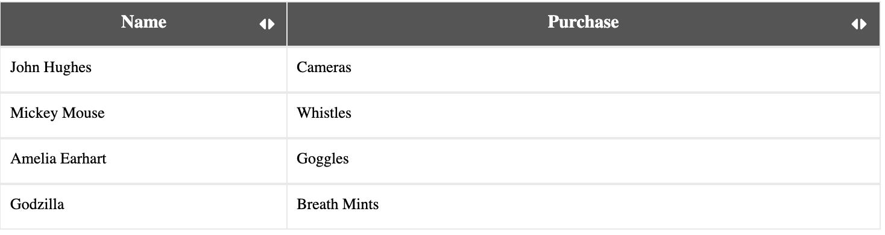

## Implementation

For resizing in percentage, let's continue developing from our <a href="./#/getting-started">Getting Started</a> section.

```html
<tablejs-grid [resizeColumnWidthByPercent]="true">
  <table>
    <thead>
      <tr tablejsGridRow>
        <th tablejsDataColClasses="name">
          <div>Name</div>
        </th>
        <th tablejsDataColClasses="item">
          <div>Purchase</div>
        </th>
      </tr>
    </thead>

    <tbody tablejsViewport>
      <tr *ngFor="let purchase of purchases" tablejsGridRow>
        <td>
          <div tablejsDataColClass="name" initialWidth="30%">
          {{ purchase.name }}
          </div>
        </td>
        <td>
          <div tablejsDataColClass="item" initialWidth="70%">
          {{ purchase.item }}
          </div>
        </td>
      </tr>
    </tbody>
  </table>
</tablejs-grid>
```

To implement resize functionality, we can place a `resizableGrip` directive on any element to designate it as a column's resizing handler.  In our case, we will add the `resizableGrip` functionality on a FontAwesome `i` tag.

Note: You may need to add the following script to your index.html file if you don't already have FontAwesome imported:

```html
<link rel="stylesheet" href="https://use.fontawesome.com/releases/v5.6.3/css/all.css" integrity="sha384-UHRtZLI+pbxtHCWp1t77Bi1L4ZtiqrqD80Kn4Z8NTSRyMA2Fd33n5dQ8lWUE00s/" crossorigin="anonymous">
```

Our Updated HTML should look like the following:

```html
<tablejs-grid [resizeColumnWidthByPercent]="true">
  <table>
    <thead>
      <tr tablejsGridRow>
        <th tablejsDataColClasses="name">
          <div>Name</div>
          <i class="fas fa-sort resize" resizableGrip></i>
        </th>
        <th tablejsDataColClasses="item">
          <div>Purchase</div>
          <i class="fas fa-sort resize" resizableGrip></i>
        </th>
      </tr>
    </thead>

    <tbody tablejsViewport>
      <tr *ngFor="let purchase of purchases" tablejsGridRow>
        <td>
          <div tablejsDataColClass="name" initialWidth="30%">
          {{ purchase.name }}
          </div>
        </td>
        <td>
          <div tablejsDataColClass="item" initialWidth="70%">
          {{ purchase.item }}
          </div>
        </td>
      </tr>
    </tbody>
  </table>
</tablejs-grid>
```

Let's add some CSS to style the resize grips a bit more!

```scss
.fa-sort.resize {
  transform: rotate(90deg);
  position: absolute;
  right: 12px;
  top: 10px;
  cursor: pointer;
}
```
<br/>
Voila!  Your columns can now be resized and should look like this!



<h3>Example of resizing columns calculated in percent</h3>
<div>Open <a href="https://stackblitz.com/edit/tablejs-community-resize-percent-ivy" target="_blank">Example</a> in StackBlitz <a href="https://stackblitz.com/edit/tablejs-community-resize-percent-ivy" target="_blank"><i class="fas fa-external-link-alt"></i></a></div><p></p>
<iframe width="100%" height="350px" src="https://stackblitz.com/edit/tablejs-community-resize-percent-ivy?ctl=1&embed=1&file=src/app/app.component.ts&hideExplorer=1&hideNavigation=1&theme=light&view=preview"></iframe>
