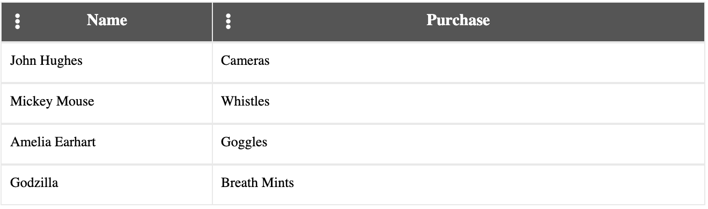

## Implementation

For column reordering, we will continue developing our table from the <a href="./#/getting-started">Getting Started</a> section.

```html
<tablejs-grid [resizeColumnWidthByPercent]="true">
  <table>
    <thead>
      <tr tablejsGridRow>
        <th tablejsDataColClasses="name">
          <div>Name</div>
        </th>
        <th tablejsDataColClasses="item">
          <div>Purchase</div>
        </th>
      </tr>
    </thead>

    <tbody tablejsViewport>
      <tr *ngFor="let purchase of purchases" tablejsGridRow>
        <td>
          <div tablejsDataColClass="name" initialWidth="30%">
          {{ purchase.name }}
          </div>
        </td>
        <td>
          <div tablejsDataColClass="item" initialWidth="70%">
          {{ purchase.item }}
          </div>
        </td>
      </tr>
    </tbody>
  </table>
</tablejs-grid>
```

We will need to tell TableJS which columns we want to be able to reorder.  We do this by adding the `reorderCol` directive to  each `th` element.

```html
<tablejs-grid [resizeColumnWidthByPercent]="true">
  <table>
    <thead>
      <tr tablejsGridRow>
        <th tablejsDataColClasses="name" reorderCol>
            <div>Name</div>
        </th>
        <th tablejsDataColClasses="item" reorderCol>
            <div>Purchase</div>
        </th>
      </tr>
    </thead>

    <tbody tablejsViewport>
      <tr *ngFor="let purchase of purchases" tablejsGridRow>
        <td>
          <div tablejsDataColClass="name" initialWidth="30%">
          {{ purchase.name }}
          </div>
        </td>
        <td>
          <div tablejsDataColClass="item" initialWidth="70%">
          {{ purchase.item }}
          </div>
        </td>
      </tr>
    </tbody>
  </table>
</tablejs-grid>
```

We will next want to designate which element to use as the grip for reordering.  Let's add a FontAwesome `i` element to tell the user which elements will reorder the columns. Add the `reorderGrip` directive to each `i` element to give it reorder functionality.

Note: You may need to add the following script to your index.html file if you don't already have FontAwesome imported:

```html
<link rel="stylesheet" href="https://use.fontawesome.com/releases/v5.6.3/css/all.css" integrity="sha384-UHRtZLI+pbxtHCWp1t77Bi1L4ZtiqrqD80Kn4Z8NTSRyMA2Fd33n5dQ8lWUE00s/" crossorigin="anonymous">
```

```html
<tablejs-grid [resizeColumnWidthByPercent]="true">
  <table>
    <thead>
      <tr tablejsGridRow>
        <th tablejsDataColClasses="name" reorderCol>
            <div>
                <i class="fas fa-ellipsis-v" reorderGrip></i>
                Name
            </div>
        </th>
        <th tablejsDataColClasses="item" reorderCol>
            <div>
                <i class="fas fa-ellipsis-v" reorderGrip></i>
                Purchase
            </div>
        </th>
      </tr>
    </thead>

    <tbody tablejsViewport>
      <tr *ngFor="let purchase of purchases" tablejsGridRow>
        <td>
          <div tablejsDataColClass="name" initialWidth="30%">
          {{ purchase.name }}
          </div>
        </td>
        <td>
          <div tablejsDataColClass="item" initialWidth="70%">
          {{ purchase.item }}
          </div>
        </td>
      </tr>
    </tbody>
  </table>
</tablejs-grid>
```

Let's add some CSS to style the reorder grips a bit more!

```scss
.fa-ellipsis-v {
  position: absolute;
  left: 12px;
  top: 10px;
  cursor: pointer;
}
```
<br/>
Your columns can now be reordered and should look like this!



TableJS also adds classes to columns that can be styled to give a user visual cues about how the table is being reordered. While the user is reordering a column, the`highlight-left` class will be added to a column as the user is hovering over the left half of a column, and the `highlight-right` classes will be added when the user is hovering over the right half of a column.  Let's add some styles to these classes so the user knows how the column is being reordered.

```scss
th,
td {
  &[reorderCol] {
    &.highlight-left {
      position: relative;
      overflow: visible !important;
    }
    &.highlight-left > div,
    &.highlight-right > div {
      overflow: visible !important;
    }
    &.highlight-left > div:after,
    &.highlight-right > div:after {
      box-sizing: border-box;
      position: absolute;
      display: block;
      background-color: rgba(122, 122, 122, 0.05);
      height: 404px;
      width: 100%;
      top: 0px;
      left: 0px;
      z-index: 5;
    }

    &.highlight-left > div {
      &:after {
        font-family: 'Font Awesome 5 Free';
        content: '';
        font-weight: 900;
        border-left-style: solid;
        border-left-width: 1px;
        border-left-color: #000000;
        padding-left: 10px;
        text-align: left;

        box-shadow: inset 3px 0 3px -3px rgba(0, 0, 0, 0.4);
      }
      &.sort-icon {
        &:after {
          display: none;
        }
      }
    }
    &.highlight-right > div {
      &:after {
        font-family: 'Font Awesome 5 Free';
        content: '';
        font-weight: 900;
        border-right-style: solid;
        border-right-width: 1px;
        border-right-color: #000000;
        padding-right: 10px;
        text-align: right;

        box-shadow: inset -3px 0 3px -3px rgba(0, 0, 0, 0.4);
      }
      &.sort-icon {
        &:after {
          display: none;
        }
      }
    }
  }
}
```

In addition to highlights, TableJS will also make an image representation of a `th` element when it is dragged to give the user a visual cue as to which column is being reordered.  You can filter out the elements you do not want to be copied into this image by using the `dragDropFilter` function.  In our example, we will filter out all `i` elements.

```typescript
dragDropFilter(el: HTMLElement): boolean {
    return el.tagName !== 'I';
}
```

Now when we reorder, we should see something like this:


That's it!  You have now implemented reorder functionality.

<h3>Example of reordering columns</h3>
<div>Open <a href="https://stackblitz.com/edit/tablejs-community-reorder-columns-ivy" target="_blank">Example</a> in StackBlitz <a href="https://stackblitz.com/edit/tablejs-community-reorder-columns-ivy" target="_blank"><i class="fas fa-external-link-alt"></i></a></div><p></p>
<iframe width="100%" height="350px" src="https://stackblitz.com/edit/tablejs-community-reorder-columns-ivy?ctl=1&embed=1&file=src/app/app.component.ts&hideExplorer=1&hideNavigation=1&theme=light&view=preview"></iframe>